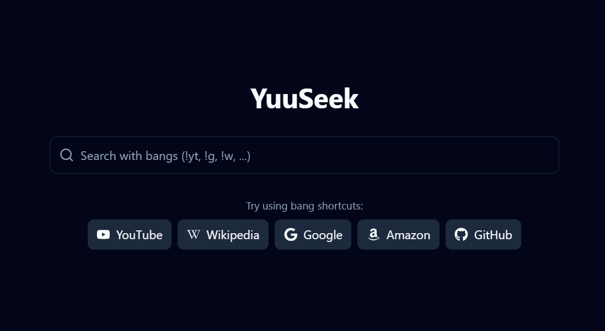

# YuuSeek

[](https://nextjs.org/)
[](https://reactjs.org/)
[](https://www.typescriptlang.org/)
[](https://tailwindcss.com/)
[](LICENSE)

A modern client-side bang search engine leveraging DuckDuckGo's bang shortcuts for efficient web searching.



## Overview

YuuSeek is a privacy-focused search interface that enhances your search experience by using bangs - special search syntax prefixed with an exclamation mark (!) that redirects your search to specific websites. For example, typing `!w cats` will search directly on Wikipedia for "cats".

This is a client-side only application, meaning your search queries are never stored on our servers - all searches go directly to your chosen search provider.

## Features

- 🚀 **Bang Shortcuts**: Access thousands of websites directly using DuckDuckGo's bang syntax
- 🎭 **Multiple Prefix Characters**: Use `!`, `$`, or `?` as your preferred bang prefix
- 🌙 **Dark/Light Mode**: Toggle between themes for comfortable browsing
- 🔍 **Smart Search Suggestions**: Intelligent suggestions as you type
- ⚡ **Fast & Responsive**: Built with performance in mind
- 🔒 **Privacy-Focused**: No tracking or storing of your search queries
- 🎨 **Customizable Interface**: Settings to adjust the search experience to your preferences
- 📱 **Mobile Friendly**: Works great on all devices

### "I'm Feeling Lucky" Search

You can use the "I'm Feeling Lucky" feature to go directly to the first search result by prefixing your search with an exclamation mark (!) / dollar sign ($) / question mark (?):

```yaml
!your search query
```

This works with your default search engine:

- For Google, it uses the `btnI=1` parameter
- For DuckDuckGo, it uses the `!ducky` bang
- For other search engines, it falls back to their default search or equivalent functionality

Examples:

- `$wikipedia` - Takes you directly to Wikipedia.org
- `?weather new york` - Takes you directly to a weather forecast for New York

## Tech Stack

- **Frontend**: Next.js 15, React 19
- **Language**: TypeScript
- **Styling**: TailwindCSS 4
- **UI Components**: Custom components with Radix UI
- **Animations**: Framer Motion
- **State Management**: React Context API
- **Notifications**: Sonner
- **Code Quality**: ESLint, Prettier

## Getting Started

### Prerequisites

- Node.js (v18 or higher)
- npm / yarn / bun / pnpm

### Installation

1. Clone the repository:

```bash
git clone https://github.com/Yuzu02/YuuSeek.git
cd yuuseek
```

2. Install dependencies:

```bash
npm install
# or
yarn install
# or
pnpm install
# or
bun install
```

3. Start the development server:

```bash
npm run dev
# or
yarn dev
# or
pnpm dev
# or
bun dev
```

4. Open your browser and navigate to `http://localhost:3000`

### Building for Production

To build the application for production:

```bash
npm run build
# or
yarn build
# or
pnpm build
# or
bun build
```

To start the production server:

```bash
npm run start
# or
yarn start
# or
pnpm start
# or
bun start
```

## Usage

### Basic Search

Simply type your query in the search bar and press Enter. YuuSeek will use your default search engine.

### Using Bang Shortcuts

YuuSeek supports multiple prefix characters for bang shortcuts:

- **Exclamation Mark (`!`)**: Traditional DuckDuckGo style - `!w cats`
- **Dollar Sign (`$`)**: Alternative prefix - `$w cats`
- **Question Mark (`?`)**: Alternative prefix - `?w cats`

All of these will search Wikipedia for "cats".

In a future update, you'll be able to customize your preferred prefix character to any symbol you like.

#### Examples with Different Prefixes

| Bang      | With `!`     | With `$`     | With `?`     |
| --------- | ------------ | ------------ | ------------ |
| Google    | `!g weather` | `$g weather` | `?g weather` |
| YouTube   | `!yt music`  | `$yt music`  | `?yt music`  |
| Wikipedia | `!w physics` | `$w physics` | `?w physics` |

### Popular Bang Shortcuts

| Bang | Website        | Example                 |
| ---- | -------------- | ----------------------- |
| !g   | Google         | !g weather forecast     |
| !w   | Wikipedia      | !w quantum physics      |
| !yt  | YouTube        | !yt coding tutorials    |
| !a   | Amazon         | !a wireless headphones  |
| !gh  | GitHub         | !gh react hooks         |
| !r   | Reddit         | !r nextjs               |
| !so  | Stack Overflow | !so javascript promises |

## Configuration

You can adjust YuuSeek's settings through the settings menu, including:

- Default search engine
- Interface appearance
- Preferred bang prefix character
- Animation preferences
- Search behavior options

In future updates, you'll be able to fully customize the prefix character to any symbol of your choice.

## Contributing

Contributions are welcome! Please feel free to submit a Pull Request.

1. Fork the repository
2. Create your feature branch (`git checkout -b feature/amazing-feature`)
3. Commit your changes (`git commit -m 'Add some amazing feature'`)
4. Push to the branch (`git push origin feature/amazing-feature`)
5. Open a Pull Request

### Development Guidelines

- Follow the existing code style
- Write tests for new features
- Update documentation as needed

## License

This project is licensed under the GNU Affero General Public License v3.0 - see the [LICENSE](LICENSE) file for details.

## Acknowledgements

- [DuckDuckGo](https://duckduckgo.com/) for the bang shortcut data
- [Next.js](https://nextjs.org/) for the awesome React framework

---

<div align="center">
Made with ❤️ by Yuzu02
</div>
